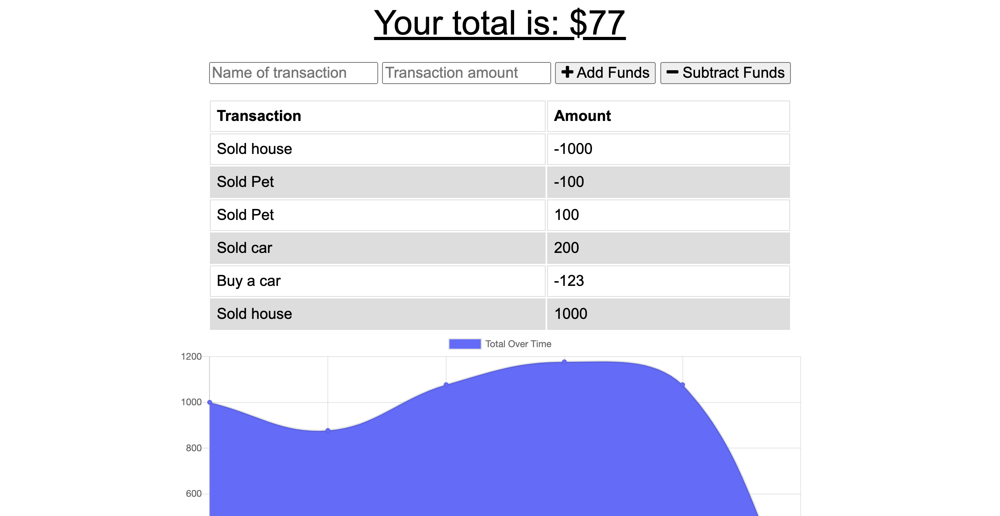

# Budget Tracker


## Description  
Budget Tracker Application that allows tracking of budget with or without a connection. It illustrates financial progress in a time frame. This application implement [MongoDB](https://www.mongodb.com/) database with a Mongoose schema, indexDB for storing pending transaction and handle routes with [Express](https://www.npmjs.com/package/express). The site is hosted on [Heroku](https://www.heroku.com/).


    
## Table of Contents   
* [User Story](#User-Story)
* [Business Context](#Business-Context)
* [Acceptance Criteria](#Acceptance-Criteria)
* [Installation](#Installation)
* [Usage](#Usage)
* [Credits](#Credits)
* [License](#License)
* [Questions](#Questions)

## User Story
AS AN avid traveller
I WANT to be able to track my withdrawals and deposits with or without a data/internet connection
SO THAT my account balance is accurate when I am traveling

## Business Context

Giving users a fast and easy way to track their money is important, but allowing them to access that information anytime is even more important. Having offline functionality is paramount to our applications success.

## Acceptance Criteria
GIVEN a user is on Budget App without an internet connection
WHEN the user inputs a withdrawal or deposit
THEN that will be shown on the page, and added to their transaction history when their connection is back online.

## Installation
1. Clone the repo.
2. Navigate to the project directory.
3. Run command ```npm install``` to install any dependencies.

## Usage    
* Navigate to [Budget Tracker Site]().
* Enter name of transaction.
* Enter transaction amount.
* Click on Add or subtract funds.

## Credits  
Developed by: 
Manuel Leung Chen ([GitHub](https://github.com/manuelleungchen))

Deployment Tools used: 
* [Express](https://www.npmjs.com/package/express)
* [Heroku](https://www.heroku.com/)
* [Mongoose](https://www.npmjs.com/package/mongoose)

## License
Copyright (c) 2020 - Manuel Leung Chen

Licensed under the [MIT License](https://choosealicense.com/licenses/mit/).
 

## Questions
Manuel Leung Chen - [GitHub](https://github.com/manuelleungchen )

If you have any question about this application, please reach out me by [Email](manuel.leungchen@gmail.com)

